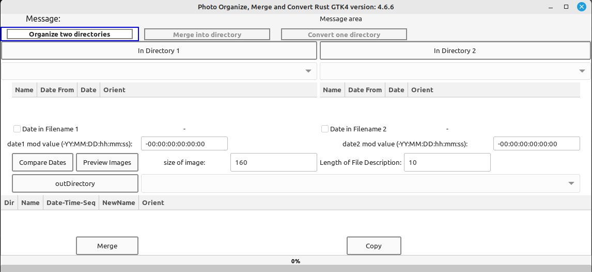
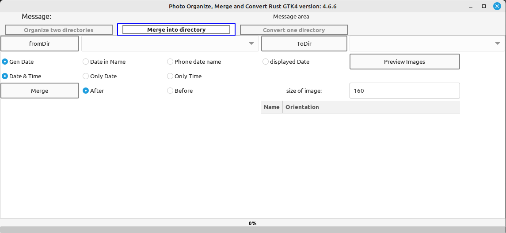
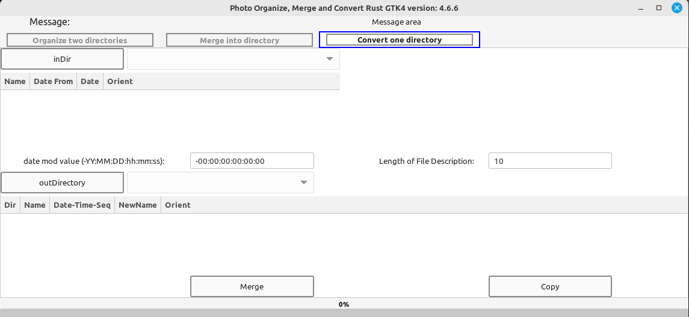

# photoomc04
Rust-GTK4 Image folders merging and renaming.

This program has three major functions. First is to merge two folders into one with renaming and have valid exif data. Second is to merge images into a merge folder where the files to merge don't need exif data. Third is to create a merge folder based on one folder with exif data. 

